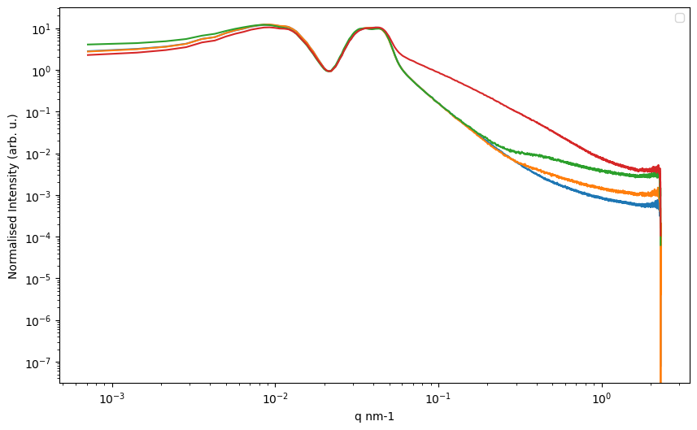

# Small-Angle-X-Ray-Scattering-Data-Processing
Python/Jupyter tools for Small-Angle X-ray Scattering data processing

  
  

   
SAXS software and tools is a Python package containing mostly jupyter notebooks that enables:
1. Reading the 2D scattering patterns from the Bruker Nanostar detector
2. Backround subtraction and transmission correction of integrated curves
3. Step-by-step visualization of the process
4. Calculation of the uncertainties' propagation on the final I-q data sheets
   

- **Bugs** dsapalidis@gmail.com
